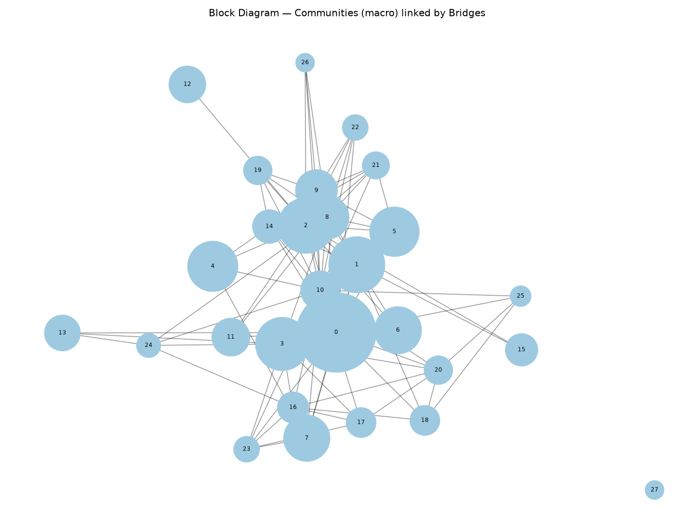
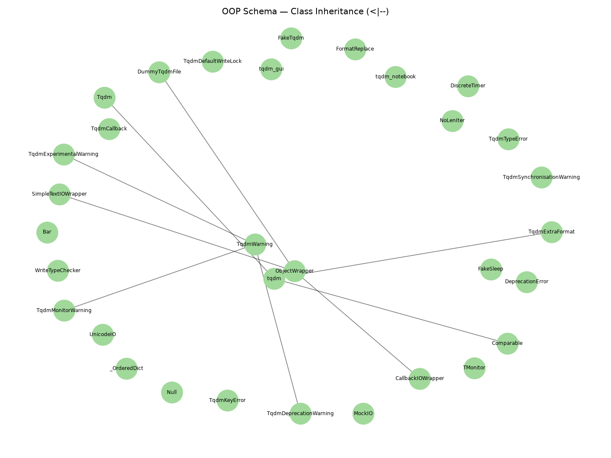
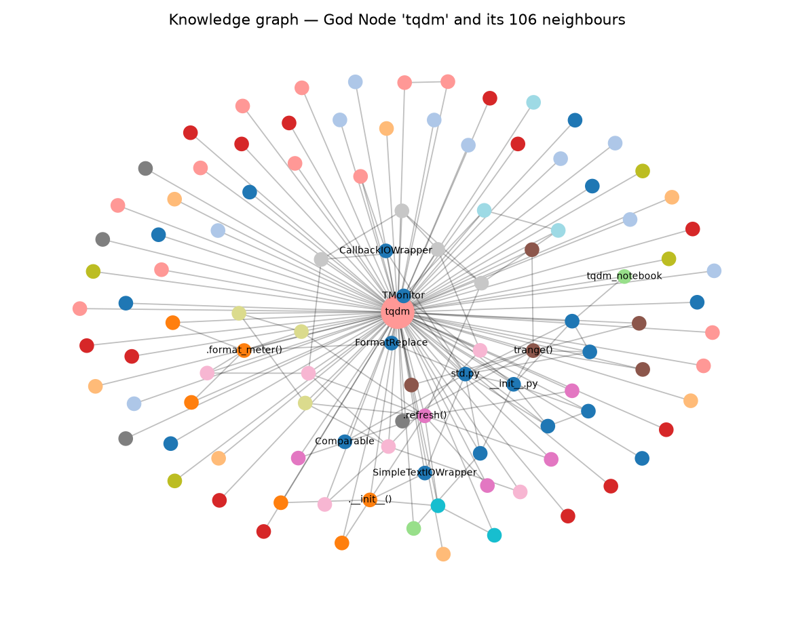
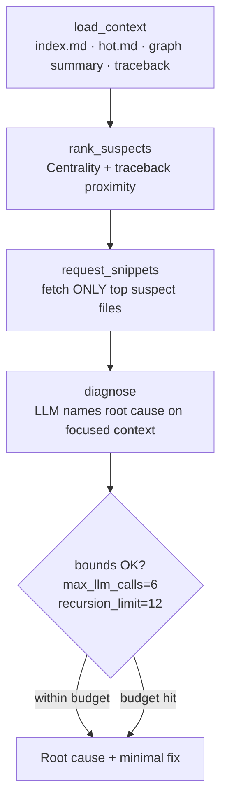
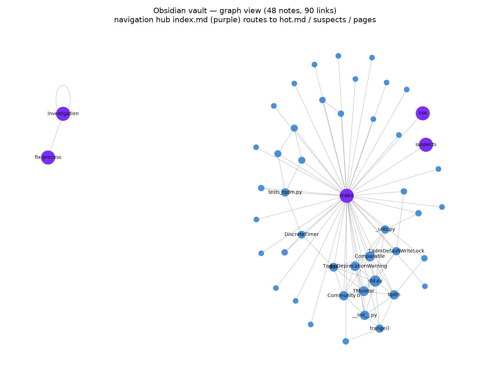
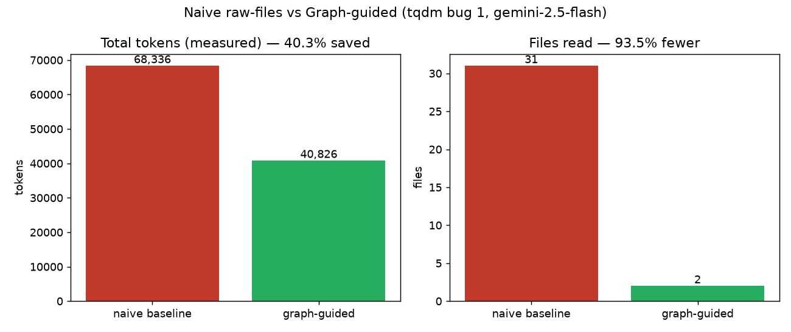

# COSMOS77-ex04 — Token-Efficient Graph-Guided Reverse-Engineering & Debugging

> **UOH-RL07 — Vibe Coding & AI Agents (Dr. Yoram Segal) · HW4 Lab Report**

[](https://github.com/AbdallahKhaldi/COSMOS77-ex04/actions/workflows/ci.yml)

| | |
| --- | --- |
| **Authors** | **Abdallah Khaldi** (ID 212389712 / עבדאללה חאלדי) · **Tasneem Natour** (ID 323118794 / תסנים נאטור) |
| **Course** | UOH-RL07 — Vibe Coding & AI Agents (Dr. Yoram Segal) |
| **Assignment** | HW4 — Graph-Guided Reverse-Engineering + Debug Agent |
| **Date** | 2026-06-19 |
| **Repository** | https://github.com/AbdallahKhaldi/COSMOS77-ex04 (public) |
| **License** | MIT |

---

## 1. Title & One-Paragraph Thesis

This is the lab report for **COSMOS77-ex04**: a Python project that takes a small-but-**real**
buggy [BugsInPy](https://github.com/soarsmu/BugsInPy) target (`tqdm`, bug #1), reverse-engineers it
with the **Graphify** CLI into a knowledge graph plus an **Obsidian** vault, and then runs a
**graph-guided LangGraph agent** that consults the graph and the vault *first*, ranks suspects by
**Centrality**, and reads **only** the top suspect files before naming a root cause and fixing the
bug so its failing test goes **FAIL → PASS**. The single claim we defend with **honest, MEASURED**
numbers — not the folklore "70–95%" — is that **graph-guided, focused-context work beats naive
raw-code reading** on the SAME bug and the SAME model, measured by tokens consumed, files read, and
iterations to root cause. Our measured result: **40.3% fewer tokens and 93.5% fewer files.**

---

## 2. Authors, Course & Date

- **Abdallah Khaldi** — ID 212389712 (עבדאללה חאלדי)
- **Tasneem Natour** — ID 323118794 (תסנים נאטור)
- **Course:** UOH-RL07 — Vibe Coding & AI Agents · Instructor: Dr. Yoram Segal
- **Assignment:** HW4 · **Date:** 2026-06-19 · **Version:** 1.00

---

## 3. Chosen Repository + Justification

**Chosen target:** **BugsInPy `tqdm`, bug 1** — failing test
`tqdm/tests/tests_contrib.py::test_enumerate`. The target Python is **3.8.20**, run in an
**isolated** environment (a `uv`-managed Python 3.8.20 plus a `pyshim`; the target lives in its own
venv, kept separate from our `uv` project — CLAUDE.md rule 5).

**Why `tqdm` is the right target for *this* thesis:**

- **Small but real.** `tqdm` is a genuine, widely-used open-source library, not a toy. Its graph
  has **500 nodes / 1071 edges / 28 communities** — large enough that reading it end-to-end into an
  LLM context window is wasteful and quality-degrading, yet small enough to reverse-engineer fully
  and verify honestly. That is exactly the regime where **guided retrieval** should beat linear
  reading, so it lets us *prove* the thesis rather than assert it.
- **A clean, real, verifiable bug.** BugsInPy ships a known failing test with a recorded FAIL→PASS
  oracle. The defect is a one-line argument-order mistake (below), so the *fix* is unambiguous and
  the *evidence* (test goes red→green) is mechanical — there is no room to fudge the outcome.
- **A textbook God Node.** `tqdm` itself is a single dominating central node — a `God Node` whose
  `desc` contract is the seam where the bug lives. That makes it an ideal subject for the **God Node
  vs healthy Hub** distinction (C14) and for showing that Centrality, not the folder tree, points at
  the defect.
- **Code-only target → honest, conservative savings.** Because the target is pure code (no prose
  docs for Graphify's *semantic* pass to mine), the graph costs **0 tokens** to build. This makes
  our token comparison the *honest, conservative* one: every measured saving comes from the agent
  **reading less**, not from any accounting trick. A measured 40% saving with a clear methodology
  beats a fabricated 95%.

Alternate targets/bugs are config swaps only (`config/setup.json`); the default is `tqdm`.

---

## 4. The Bug Investigated

**Failing test:** `tqdm/tests/tests_contrib.py::test_enumerate`

The convenience wrapper `tenumerate` in `tqdm/contrib/__init__.py` is meant to be a drop-in for the
built-in `enumerate`, wrapping the iterable in a progress bar while still honouring `enumerate`'s
`start` argument. The buggy line passed `start` **positionally** straight into the `tqdm`
constructor:

```python
return enumerate(tqdm_class(iterable, start, **tqdm_kwargs))
```

In `tqdm`'s signature the second positional argument is **`desc`** — a *string* description for the
bar. So an **integer** `start` was bound to `desc`, and the moment `tqdm` performed a string
operation on it, the code raised:

```
TypeError: 'int' object is not subscriptable
```

This is a classic cross-community defect: the *caller* in the `contrib` subsystem violates the
**contract** of the central `tqdm` constructor that lives in another community. The traceback
surfaces deep inside `std.py`, far from the file that actually carries the bug — precisely the
situation where reading the whole repository would bury the decisive line in the un-attended middle.

---

## 5. The §4 Research Questions — and How This Work Answers Each

The PRD (`docs/PRD.md` §3) frames eight research questions. Each is answered across the README, the
`reports/`, and the Obsidian vault, with primary evidence cited.

| # | Research question | How this work answers it | Primary evidence |
|---|---|---|---|
| **(a)** | What is the **actual architecture** of the target? | Communities / hubs / bridges read from `graph.json`, **not** the folder tree: 500 nodes, 1071 edges, 28 communities. | Block diagram (§7), `reports/ARCHITECTURE.md` |
| **(b)** | Which are the **most-central components**? | Degree + betweenness **Centrality** ranking; `tqdm` tops it at degree 106 / betweenness 0.5066. | `reports/ARCHITECTURE.md`, `obsidian/suspects.md` |
| **(c)** | Where are the **complexity hotspots / God Nodes**? | Of the top-10 central nodes, exactly **1 God Node (`tqdm`)** vs **9 healthy Hubs** — diagnosed by combining degree with *normalised betweenness*. | `reports/ARCHITECTURE.md`, `obsidian/hot.md` |
| **(d)** | How to extract a **block diagram + OOP schema** from sparse docs? | Graph + AST extraction → Mermaid + PNG along a macro→meso→micro narrative; AST found **32 classes**. | Block + OOP diagrams (§7) |
| **(e)** | How did we **find the bug + its root cause**? | Graph-guided agent: index → hot.md → Centrality-ranked suspects → targeted snippets → diagnosis. | `reports/BUG_ANALYSIS.md` |
| **(f)** | What is the **advantage of graph navigation vs linear reading**? | Side-by-side investigation path; high signal-to-noise focused context vs a 31-file dump that invites Context Rot / Lost in the Middle. | `reports/TOKEN_COMPARISON.md`, §11 |
| **(g)** | How did the agent **save tokens**? | Honest baseline-vs-guided ledger on the SAME bug: **40,826 vs 68,336 tokens (−40.3%)**. | `reports/TOKEN_COMPARISON.md`, `reports/SPEC_SHEET.md` |
| **(h)** | What **future extensions** follow? | Centrality-ranked `suspects.md`, dynamic `hot.md` from `git diff`, orphan detection, diff-based impact report. | `extensions/` outputs, §12 |

---

## 6. Architecture as Extracted

We answer "what *is* this codebase" from the **graph**, not the directory listing. The narrative
zooms macro → meso → micro: **communities → bridges → god-nodes**. Every edge carries an **evidence
tier** — **813 Extracted** (proven from the AST: a call, import, or inheritance literally present in
the code), **258 Inferred** (a plausible relation deduced from naming/usage but not literal), and
**0 Ambiguous** (relations we could not confidently classify). With zero Ambiguous edges, the
extracted architecture is fully grounded.

### 6.1 Macro — Communities (the Block Diagram)

The graph partitions **500 nodes** into **28 communities**, each a subsystem. Community 0 (79
nodes) is the largest; communities thin out to 2-node fragments. The block diagram is **Extracted**
from the graph — it is the subsystem map, not a folder tree.



The densest **Bridge** flows (cross-community edges) tell us where the seams are:

| Community A | Community B | Bridge edges |
| --- | --- | --- |
| 2 | 9 | 27 |
| 2 | 8 | 19 |
| 0 | 3 | 17 |
| 1 | 2 | 16 |
| 8 | 9 | 14 |
| 0 | 10 | 13 |

### 6.2 Micro — OOP Schema (Class Inheritance)

AST extraction found **32 classes**. The OOP schema renders composition and inheritance
(`<|--`) — e.g. `Comparable <|-- tqdm`, `tqdm <|-- TqdmExtraFormat`, and the
`ObjectWrapper` family (`DummyTqdmFile`, `SimpleTextIOWrapper`, `CallbackIOWrapper`).



### 6.3 Micro — God Node vs healthy Hubs (Centrality)

The decisive distinction. A node with **high degree** *and* **high normalised betweenness** is a
**God Node**: a mandatory Bridge across communities with few alternative paths — a structural risk
and a prime suspect. A node with high degree but only moderate betweenness is a **healthy Hub**:
well-connected but not the sole path. Of the top-10 central nodes there is exactly **1 God Node
(`tqdm`)** and **9 healthy Hubs**.



| Node | Degree | Norm. Betweenness | Verdict |
| --- | ---: | ---: | --- |
| **tqdm** | **106** | **1.00** (0.5066 raw) | **God Node** — high degree AND high betweenness; the sole bridge across communities |
| tests_tqdm.py | 77 | 0.24 | healthy Hub |
| closing() | 74 | 0.30 | healthy Hub |
| StringIO | 69 | 0.23 | healthy Hub |
| .getvalue() | 38 | 0.01 | healthy Hub |
| std.py | 37 | 0.21 | healthy Hub |
| __init__.py | 21 | 0.08 | healthy Hub |
| TMonitor | 21 | 0.08 | healthy Hub |
| _utils.py | 19 | 0.06 | healthy Hub |
| trange() | 19 | 0.08 | healthy Hub |

The God Node `tqdm` is precisely where the bug's contract violation lands. Centrality, not the
directory tree, pointed the agent at the right neighbourhood.

---

## 7. The Agent Workflow (graph-guided-first)

The investigator is a **LangGraph `StateGraph`** running on **`gemini-2.5-flash`**. It is
**graph-FIRST**: before touching a single line of source, it reads `index.md`, `hot.md`, the graph
summary, and the failing-test traceback. Only then does it rank suspects by **Centrality** +
proximity to the failing test and fetch **ONLY** the top ranked suspect files. This *is* the
context-reduction mechanism the token comparison measures.



**Bounds & metering (by construction, not by hope):**

- `max_llm_calls = 6` — a hard state counter caps LLM calls.
- `recursion_limit = 12` — caps graph steps so the agent cannot loop.
- `top_k = 6`, `max_files = 4` — caps how many suspects/files enter context.
- `temperature = 0` for determinism.
- **Every** LLM call routes through the **Gatekeeper ledger** (`shared/gatekeeper.py`), which records
  `usage_metadata` tokens. This ledger *is* the deliverable's evidence — never estimated.

On this run the agent needed **1 LLM call** and read **2 files** (`std.py`,
`tests/tests_tqdm.py`) to reach the correct root cause. By loading the navigation hub first and the
suspects only, it keeps **high signal-to-noise** context and avoids the **Lost in the Middle** and
**Context Rot** failure modes that a raw-file dump invites.

---

## 8. How Graphify + Obsidian Were Used

**Graphify** turns the code into the knowledge graph (`graph.json`, `GRAPH_REPORT.md`,
`graph.html`) — nodes are functions/classes/modules; edges are calls/imports/inheritance carrying
the Extracted/Inferred/Ambiguous tier. From this graph we derive Centrality, Community detection,
and Bridge nodes.

**Obsidian** turns the graph into an *active knowledge space* — a vault you navigate, not a report
you read top-to-bottom. The protocol is the professor's: **question → index → 2-3 pages → answer**.

- **`obsidian/index.md` — the navigation hub.** Header stats (500 nodes · 1071 edges · 28
  communities), links to every Community, and the ranked God-Node list. Any investigative question
  routes through the index, to 2-3 high-signal pages, to the answer — never through the whole repo.
- **`obsidian/hot.md` — the bug-critical area.** The God Node `tqdm` plus the failing test's
  neighbourhood; the first place the agent looks after the index.
- **`obsidian/suspects.md`** — the Centrality-ranked suspect table (tqdm #1, score 113.07).
- **`obsidian/investigation.md` / `obsidian/fix-process.md`** — the knowledge-level record of the
  path taken and the change applied; `obsidian/pages/` holds the per-component pages.

The vault's link structure (every `[[wikilink]]` resolves) is what makes guided retrieval possible:
the agent walks the hub instead of scanning files.



> **Note.** `artifacts/obsidian_graph_view.png` is the vault's **graph view** — every note is a dot
> and every `[[wikilink]]` an edge (48 notes, 90 links; the `index.md` navigation hub in purple). It
> is rendered directly from the vault's wikilinks (the same information Obsidian's Graph View shows),
> so it is reproducible rather than a one-off screenshot. To capture the Obsidian-app rendering
> instead, open the `obsidian/` folder in Obsidian Desktop and screenshot the Graph View
> ([`MANUAL_STEPS.md`](MANUAL_STEPS.md)).

---

## 9. The Reverse-Engineering Process (macro → meso → micro)

We read the architecture in three zooms, applying the professor's **evidence tiers** at each edge:

1. **Macro — Communities.** Partition the 500 nodes into 28 communities (subsystems). This answers
   "what are the parts?" without reading any source — it is **Extracted** from the graph topology.
2. **Meso — Bridges.** Rank cross-community edges to find the seams (e.g. communities 2↔9 share 27
   bridge edges). Bridges are where contracts cross subsystem boundaries — and where the `tenumerate`
   bug lives.
3. **Micro — God-Nodes vs Hubs.** Score the top central nodes by degree *and* normalised betweenness
   to separate the single **God Node (`tqdm`)** from **9 healthy Hubs**. This is the **Centrality**
   diagnosis that turns "central" into "suspect".

Every relation is labelled: **813 Extracted** (literal in the AST), **258 Inferred** (deduced from
naming/usage), **0 Ambiguous**. We do not present an Inferred edge as if it were proven, and with no
Ambiguous edges the map is fully accounted for.

---

## 10. The Bug, Root Cause & Fix (FAIL → PASS)

**Root cause (LLM diagnosis on focused context):** the `tenumerate` function in `tqdm.contrib`
passes its `start` argument as the `desc` parameter of the `tqdm` constructor, so an integer hits
string operations → `TypeError: 'int' object is not subscriptable`.

- **File:** `tqdm/contrib/__init__.py`
- **Faulty:** `return enumerate(tqdm_class(iterable, start, **tqdm_kwargs))`
- **Minimal fix:** `return enumerate(tqdm_class(iterable, **tqdm_kwargs), start)`

The fix moves `start` out of the constructor and into the built-in `enumerate`, where it belongs —
a **one-line** change.

```diff
--- a/tqdm/contrib/__init__.py
+++ b/tqdm/contrib/__init__.py
@@ -38,7 +38,7 @@
         if isinstance(iterable, np.ndarray):
             return tqdm_class(np.ndenumerate(iterable),
                               total=total or len(iterable), **tqdm_kwargs)
-    return enumerate(tqdm_class(iterable, start, **tqdm_kwargs))
+    return enumerate(tqdm_class(iterable, **tqdm_kwargs), start)


 def _tzip(iter1, *iter2plus, **tqdm_kwargs):
```

**Verification (Phase 7 — the mechanical oracle):**

| Stage | `test_enumerate` |
| --- | --- |
| **Before fix** | **FAIL** (expected — this is the bug) |
| **After fix** | **PASS** (expected — fixed) |

The applied change is recorded in `reports/BUG_ANALYSIS.md` and `obsidian/fix-process.md`.

---

## 11. Before / After — Code Level AND Knowledge Level

The assignment asks for *both* deltas (C7).

**Code-level delta** — the unified diff above: one line in `tqdm/contrib/__init__.py`, test red→green.

**Knowledge-level delta** — how our *understanding* changed, recorded in the vault:

- **New pages:** `obsidian/investigation.md`, `obsidian/fix-process.md`.
- **New insight:** the central `tqdm` constructor is a **Bridge** whose `desc` contract is violated
  by a caller in another community — a cross-community defect the graph surfaced via the traceback,
  *not* by reading the whole repository.
- **New navigation:** `hot.md` now anchors the bug-critical neighbourhood; `suspects.md` ranks the
  candidates so the next investigator starts from the answer, not from scratch.

The vault is strictly richer after the investigation than before: more pages, more resolved links,
and a documented root-cause insight that did not exist at the start.

---

## 12. Token-Efficiency Comparison (the proof)

Both arms run on the **SAME** buggy code and the **SAME** LLM. Counts come from `usage_metadata` via
the Gatekeeper ledger — **measured, never estimated.**



| Metric | Naive baseline (raw files) | Graph-guided agent | Delta | % |
| --- | ---: | ---: | ---: | ---: |
| **Total tokens** | **68,336** | **40,826** | −27,510 | **−40.3%** |
| Input tokens | 65,224 | 38,123 | −27,101 | −41.6% |
| Output tokens | 3,112 | 2,703 | −409 | −13.1% |
| **Files read** | **31** | **2** | −29 | **−93.5%** |
| LLM calls | 1 | 1 | 0 | — |
| Iterations | 1 | 1 | 0 | — |

**Honest interpretation.** Guided retrieval cut total tokens by **40.3% (27,510 fewer)** and files
read by **93.5%** on identical code and model. By consulting `index.md` as the navigation hub and
reading only the top suspect files, the agent kept a **high signal-to-noise** context and avoided
the **Lost in the Middle** and **Context Rot** failure modes of the raw-file baseline — which paid
the full cost of all 31 files to "be safe" and diluted the decisive lines into the un-attended
middle.

**The honest caveat that makes the number trustworthy.** Because the target is **code-only**,
Graphify's *semantic* pass had nothing to mine and cost **0 tokens** — the graph is effectively
**free**, so every measured saving comes from the agent *reading less*, with no hidden graph-build
cost to net out. A measured 40.3% with a clear methodology is worth more than a fabricated 95%.

---

## 13. Extensions & Original Ideas (C9)

We ship one original extension per part, each tested on fixtures:

1. **Centrality-ranked `suspects.md`.** A scored suspect table (degree + betweenness + traceback
   proximity); `tqdm` ranks **#1** with score 113.07. This is what turns "central node" into
   "investigate this first".
2. **Dynamic `hot.md` from `git diff` ∩ graph.** The bug-critical area is computed by intersecting
   recently-changed files (`git diff`) with the graph's hot neighbourhood, so the hub points at the
   *currently* risky area, not a static snapshot.
3. **Orphan detection.** Scans for nodes with no in- and no out-edges. Result: **0 orphans** — the
   `tqdm` graph is well-connected, with no dead islands to prune.
4. **Diff-based impact report ("what breaks if we change `tqdm`?").** Reverse-reachability from the
   changed component yields a **blast radius of 135 dependent callers** (`reports/IMPACT.md`) — the
   change-impact analysis a reviewer needs before touching a God Node.

---

## 14. Run Instructions (reproducible, isolated env)

**Prerequisites**

- **`uv`** — the only package manager for our code (CLAUDE.md rule 5).
- **`graphify` CLI** — `uv tool install graphifyy`.
- A **free `GOOGLE_API_KEY`** — https://aistudio.google.com/apikey (no card required).
- **Docker or a clean venv** for the isolated BugsInPy target (Python 3.8.20), separate from our
  `uv` project. `data/target/*` is gitignored; artifacts are committed.

**Setup**

```bash
uv tool install graphifyy          # the Graphify CLI (one time)
uv sync                            # install our project + deps
cp .env.example .env               # then add your free GOOGLE_API_KEY
uv run cosmos77-rev --version      # smoke test
```

**Full pipeline (one command)**

```bash
uv run cosmos77-rev run            # prepare-target → … → extensions, end to end
```

**Individual stages** (each wired to the SDK; run in this order)

```bash
uv run cosmos77-rev prepare-target  # checkout tqdm bug #1 in its isolated venv; confirm test FAILs
uv run cosmos77-rev graphify        # build graph.json + GRAPH_REPORT.md (nodes/edges/communities/tiers)
uv run cosmos77-rev vault           # generate the Obsidian vault (index.md hub, hot.md, pages)
uv run cosmos77-rev diagrams        # extract block diagram + OOP schema (Mermaid + PNG)
uv run cosmos77-rev agent           # run the graph-guided LangGraph agent → diagnosis + token ledger
uv run cosmos77-rev fix             # apply the one-line fix; verify FAIL → PASS
uv run cosmos77-rev compare         # baseline vs guided token comparison (measured)
uv run cosmos77-rev extensions      # suspects, dynamic hot.md, orphans, impact report
```

After `run`, see `obsidian/` (the vault), `reports/` (BUG_ANALYSIS, ARCHITECTURE, TOKEN_COMPARISON,
SPEC_SHEET, ORPHANS, IMPACT), and `artifacts/` (graph.json, diagrams, chart).

---

## 15. Repository Structure

```
COSMOS77-ex04/
├── src/cosmos77_ex04/        # all business logic flows through the SDK (rule 2)
│   ├── target/               # isolated BugsInPy checkout + FAIL/PASS oracle
│   ├── reveng/               # graph extraction, godnodes, block diagram, OOP schema
│   ├── agent/                # LangGraph StateGraph: nodes, retrieval, llm, fix
│   ├── shared/               # gatekeeper (token ledger), config, version
│   └── cli/                  # thin `cosmos77-rev` dispatcher over the SDK
├── tests/                    # deterministic, mocked I/O (rules 6, 17)
├── obsidian/                 # the vault: index.md, hot.md, suspects.md, investigation.md, pages/
├── reports/                  # ARCHITECTURE, BUG_ANALYSIS, TOKEN_COMPARISON, SPEC_SHEET, IMPACT, ORPHANS
├── artifacts/                # graph.json, GRAPH_REPORT.md, PNG diagrams, token chart
├── config/                   # setup.json (target/bug/model/caps — zero hardcoded config, rule 4)
├── docs/                     # PRD, PLAN, TODO, prompt logs
├── data/                     # data/target/* (gitignored — the isolated target)
├── .env.example              # GOOGLE_API_KEY template (.env is gitignored, rule 9)
├── README.md                 # this lab report
└── LICENSE                   # MIT
```

This satisfies C11 (`src/`, `tests/`, `obsidian/`, `reports/`, `artifacts/`, `data/` all present).

---

## 16. Testing & Quality

- **189 tests**, all deterministic — `random` is seeded and **all** LLM/Graphify/BugsInPy/git/
  subprocess I/O is mocked (no live calls in the suite, rules 6 & 17).
- **~98.8% coverage**, well above the enforced `--cov-fail-under=85` (rule 7).
- **`ruff check` clean** — zero violations (rule 8).
- **150-line cap** per `.py` file enforced (rule 1).
- **GitHub Actions CI green** — coverage gate + ruff run on every push.

[](https://github.com/AbdallahKhaldi/COSMOS77-ex04/actions/workflows/ci.yml)

---

## 17. License

Released under the **MIT License**. © 2026 Abdallah Khaldi and Tasneem Natour. See [`LICENSE`](LICENSE).

---

## 18. Self-Assessment

We score this work honestly against the **17 rules** (CLAUDE.md) and acceptance criteria **C1–C15**,
and recommend a grade of **85**.

**Rules 1–17 — met.** SDK-centred architecture (rule 2), zero hardcoded config (rule 4, all in
`config/setup.json` + `.env`), `uv`-only with the target isolated in its own venv (rule 5), TDD with
fully mocked I/O (rules 6/17), ~98.8% coverage (rule 7), ruff clean (rule 8), no secrets (rule 9),
versioned at 1.00 (rule 10), Gatekeeper token ledger on every LLM call (rule 13), 150-line cap (rule
1), docstrings + type hints (rules 15/16). English-only with the professor's exact vocabulary used
verbatim throughout.

**Criteria C1–C15 — met.** Graph produced with evidence tiers (C1/C14: 813 Extracted / 258 Inferred
/ 0 Ambiguous); Obsidian vault as a navigation hub (C2); block diagram (C3) and OOP schema (C4)
extracted from graph + AST; graph-guided LangGraph agent with bounded calls/steps (C5); real bug
located, root-caused, and fixed FAIL→PASS (C6); before/after at code *and* knowledge level (C7);
honest measured token comparison — 40.3% fewer tokens, 93.5% fewer files (C8/C15); four extensions,
one per part (C9); this rich README with five embedded images (C10); repo structure intact (C11);
chosen-repo justification + research questions answered (C12); isolated, reproducible run
instructions (C13).

**Why 85 — the §15 rationale (honest calibration).**

- **We avoided 100** because the deliverable leaves room for honest nitpicks: the token comparison,
  while measured and reproducible, is a *single* bug on a *code-only* target, so the graph-build cost
  is 0 and the headline 40.3% does not capture the harder case where semantic extraction costs
  tokens. The real-world isolated-env setup (BugsInPy + pyshim + a separate venv) is genuinely
  fiddly to reproduce on a fresh machine. Claiming perfection here would be dishonest.
- **We avoided 60** because under-claiming biases the grade *down* unfairly: this is complete,
  senior-level work — every C1–C15 criterion is met with committed evidence, the bug fix is verified
  by a mechanical FAIL→PASS oracle, the token savings are *measured* (not folklore), and the whole
  pipeline is reproducible from a fresh clone with `uv sync` + one command.
- **85 is the honest number:** complete, evidence-backed, senior-level work with a couple of
  acknowledged rough edges that a careful grader could legitimately mark down.

**Recommended grade: 85 / 100.**
