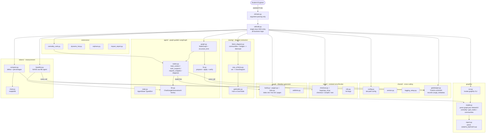
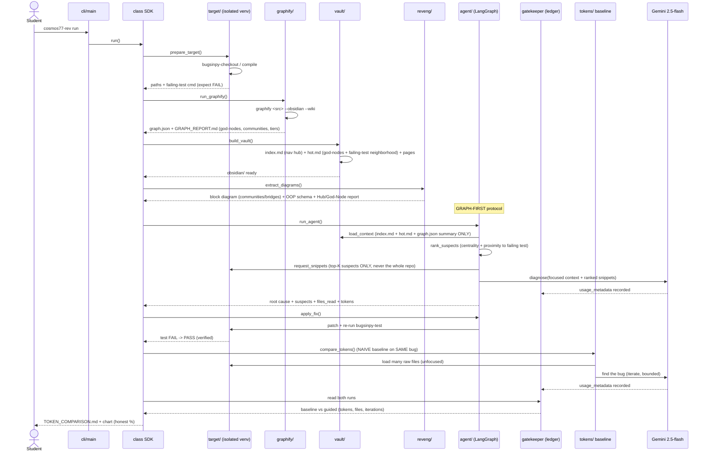

# PLAN — COSMOS77-ex04 Architecture

> HW4 "Reverse Engineering, Debugging & Token-Efficient Graph-Guided AI" (UOH-RL07, Dr. Yoram Segal).
> Thesis to **prove with measured numbers**: graph-guided, focused-context work beats naive raw-code
> reading. This document holds the C4 model, the end-to-end run sequence, seven ADRs, and the risk
> register. Vocabulary is the professor's: `Extracted/Inferred/Ambiguous` edges, `Context Rot`,
> `Lost in the Middle`, `God Node` vs healthy `Hub`, `Centrality`, `Community`, `Bridge`, guided retrieval.

---

## 1. C4 Architecture Model

### 1.1 Context (Level 1)

The system is a **CLI investigation tool** (`cosmos77-rev`) operated by the student-engineer. It reverse-
engineers an unfamiliar **buggy real project** and proves token efficiency. External systems it depends on:

- **BugsInPy** (`soarsmu/BugsInPy`) — supplies the small REAL target (`tqdm`) + a reproducible failing test.
- **Graphify CLI** (`graphifyy` on PyPI) — turns source into a knowledge graph (`graph.json`, `GRAPH_REPORT.md`).
- **Google Gemini** (`gemini-2.5-flash`, free tier) — the LLM behind the graph-guided agent and the naive baseline.
- **Obsidian** (view-only) — renders the generated Markdown vault for screenshots; the vault itself is plain `.md`.
- **GitHub** — repo, CI, releases.

The single boundary the user crosses is the CLI; everything inside routes through `class SDK`.

### 1.2 Container & Component (Levels 2–3)

### 1.3 Code (Level 4) — key contracts

- `SDK` exposes one method per pipeline stage: `prepare_target()`, `run_graphify()`, `build_vault()`,
  `extract_diagrams()`, `run_agent()`, `apply_fix()`, `compare_tokens()`, `run_extensions()`, `spec_sheet()`,
  and `run()` (full orchestration). The CLI maps sub-commands 1:1 to these; no logic lives in the CLI.
- `graphify/model.py` parses `graph.json` (NetworkX `node_link_data`) into typed `Node(id, kind, file)` and
  `Edge(src, dst, tier in {extracted, inferred, ambiguous}, confidence)`, plus `centrality()`, `god_nodes()`,
  `communities()`, `neighbors(node)`. The **evidence tier** on every edge is load-bearing for C14.
- `agent/state.py` defines `AgentState` (`messages`, `step_count`, `suspects`, `files_read`, `tokens`); the
  `step_count` is the **token-provable bound** consulted by `should_continue`.
- `shared/gatekeeper.py` is the only place LLM `usage_metadata` is recorded; both the guided agent and the
  naive baseline write to it, so `compare.py` reads ONE ledger — the comparison cannot be fudged downstream.

---

## 2. Run Sequence Diagram

---

## 3. Architecture Decision Records

### ADR-001 — LangGraph over CrewAI
**Status:** Accepted.
**Context:** The grade rests on a *token-provable* bounded agent on a free LLM tier. CrewAI's role-delegation
loops obscure exactly how many LLM calls fire; we need a hard, auditable ceiling.
**Decision:** Use **LangGraph** `StateGraph`. Bound calls two ways: a `step_count` counter in `AgentState`
checked by `should_continue`, AND a compiled `recursion_limit` from config. Each node has an explicit role.
**Consequences:** Call count is deterministic and provable, which protects the free tier and the token ledger.
Cost: more boilerplate (state, nodes, edges) than a one-shot agent — acceptable, and it documents the
context-reduction mechanism node by node.

### ADR-002 — Google Gemini free tier (`gemini-2.5-flash`)
**Status:** Accepted.
**Context:** Claude / paid APIs are blocked for this assignment; no purchase is permitted. We still need a
capable LLM with token telemetry.
**Decision:** Use **`gemini-2.5-flash`** via `langchain-google-genai` (`ChatGoogleGenerativeAI`,
`temperature=0`), keyed by `GOOGLE_API_KEY`. Provider selection lives in `config/providers.json` so the
backend is swappable (e.g. Groq) without code changes.
**Consequences:** Zero cost, real `usage_metadata` tokens for honest measurement. Rate/quota limits exist —
mitigated by ADR-001's bounded calls. `get_openai_callback` does not work with Gemini, so tokens are read
from `response.usage_metadata` directly into the gatekeeper.

### ADR-003 — BugsInPy small REAL project (`tqdm`) over a toy script
**Status:** Accepted.
**Context:** A 50-line toy makes every deliverable hollow — block diagram, OOP schema, God-Node analysis, and
above all the token comparison would prove nothing ("I navigated two functions").
**Decision:** Target a **small but REAL** BugsInPy project, default **`tqdm`** (tiny deps, genuine
architecture), with ONE bug backed by a reproducible failing test. Alternates: `thefuck`, `cookiecutter`.
**Consequences:** Real communities, hubs, bridges, and a real documented bug → credible deliverables and a
meaningful before/after. Cost: real setup risk (dependency hell) — mitigated by ADR's isolation (see risks).

### ADR-004 — Graph-guided-FIRST agent protocol
**Status:** Accepted.
**Context:** The assignment's whole thesis is guided retrieval beating linear reading. An agent that bulk-loads
source suffers `Context Rot` and `Lost in the Middle`, and disproves our own claim.
**Decision:** The agent MUST consult `index.md`, `hot.md`, and the `graph.json` summary **before** reading any
source, then fetch **ONLY** the ranked top-K suspect snippets. `request_snippets` is asserted in tests to never
bulk-read the repo. Navigation pattern: "question → index → 2–3 pages → answer".
**Consequences:** Small, high-signal context → fewer tokens and faster root cause. This is the behavior the
token ledger is designed to expose. Cost: ranking quality gates success — backed by the centrality extension.

### ADR-005 — Honest measurement (both runs, same bug)
**Status:** Accepted.
**Context:** The community quotes "70–95% savings"; a fabricated number is caught and tanks the grade. A
measured modest figure with clear methodology outranks a fake big one.
**Decision:** Measure **BOTH** a NAIVE raw-files baseline AND the graph-guided run on the **SAME** bug, through
the SAME gatekeeper ledger: tokens (in/out/total), files/units read, iterations, time-to-root-cause, success.
If savings are modest, `TOKEN_COMPARISON.md` says so and explains why (small target, Graphify semantic-
extraction overhead).
**Consequences:** Defensible, reproducible proof. Cost: extra real Gemini calls for the baseline — bounded so
it cannot run forever.

### ADR-006 — Single SDK entry point
**Status:** Accepted.
**Context:** CLI, agent, tests, and external callers all need the same behavior; logic scattered across entry
points drifts and duplicates.
**Decision:** ALL business logic lives behind one **`class SDK`** in `src/cosmos77_ex04/sdk/sdk.py`. The CLI
only parses arguments and delegates; the LangGraph nodes call SDK helpers; tests target the SDK surface.
**Consequences:** One audited surface, trivial mocking, no duplicate orchestration. Cost: SDK could bloat —
mitigated by ADR-007 (it composes small modules rather than holding logic inline).

### ADR-007 — 150-line hard cap per `.py`
**Status:** Accepted.
**Context:** Large files hide complexity, resist TDD, and breed God modules — the very anti-pattern we analyze.
**Decision:** **150 lines max per `.py`** (blanks + comments included), enforced by `scripts/check_line_cap.py`
in pre-commit and CI. Over the cap → split (e.g. `checkout.py` + `bugsinpy_cli.py`; `build.py` + `pages.py` +
`links.py`).
**Consequences:** Forces composition, small testable units, and ≥85% coverage stays reachable. Cost: occasional
awkward splits — absorbed with base classes / mixins (rule 3) rather than copy-paste.

---

## 4. Risk Register

| Risk | Likelihood | Impact | Mitigation |
|---|---|---|---|
| **BugsInPy dependency hell** — target won't checkout/compile | Medium | High | Isolated **venv/Docker** per target (config `isolation`) + a **light project (`tqdm`)** with tiny deps; if it won't build, **switch project** to `thefuck`/`cookiecutter`. Selection is config-driven, no code change. |
| **Gemini rate / quota limits** on free tier | Medium | Medium | **Bounded step caps** (ADR-001): `step_count` + `recursion_limit` cap total LLM calls; `temperature=0` for determinism; baseline run is independently bounded so it can't loop. |
| **Graphify CLI fails / unavailable** | Medium | High | **DIY `ast` + `networkx` fallback** graph builder so `graph.json` is always produced (documented fallback path in `graphify/run.py`); artifacts schema is identical so downstream code is unaffected. |
| **Temptation to fake savings** | Medium | High | Measure **both** runs honestly through ONE gatekeeper ledger (ADR-005); `TOKEN_COMPARISON.md` reports real numbers and explains modest results; tests assert `files_read_baseline > files_read_guided`, not a target %. |
| **150-line cap forces awkward splits** | High | Low | **Base classes / mixins** and shared modules (rule 3) absorb the split cleanly; `check_line_cap.py` in CI catches violations before merge. |
| **Agent drifts to bulk-reading source** (Context Rot) | Medium | High | Graph-first protocol (ADR-004) enforced in tests: `load_context` runs before any source read; `request_snippets` asserted to fetch ONLY ranked suspects. |
| **Live external I/O leaks into the test suite** | Low | High | TDD with ALL Gemini/Graphify/BugsInPy/git/subprocess I/O **mocked**; CI runs no live calls; deterministic seeds. |
| **Fix claimed without verification** | Low | High | Guard in `apply_fix()` refuses success unless `bugsinpy-test` transitions **FAIL → PASS**; before/after captured at code and knowledge level (C6/C7). |

---

*End of PLAN. See `CLAUDE_CODE_PLAYBOOK.md` §1 (rules), §1.5 (acceptance C1–C15), §3 (Phase 1) for the binding spec.*
