# Reverse-Engineered Architecture

A graph-extracted, three-zoom narrative: macro (communities) -> meso (bridges) -> micro (god-nodes). Diagrams are Extracted from the AST/graph.

## Macro — Communities (Block Diagram)

The graph has **500 nodes** in **28 communities**. Each block below is one Community, sized by member count.

```mermaid
flowchart TD
    C0["Community 0<br/>(79 nodes)"]
    C1["Community 1<br/>(38 nodes)"]
    C2["Community 2<br/>(37 nodes)"]
    C3["Community 3<br/>(34 nodes)"]
    C4["Community 4<br/>(30 nodes)"]
    C5["Community 5<br/>(29 nodes)"]
    C6["Community 6<br/>(26 nodes)"]
    C7["Community 7<br/>(25 nodes)"]
    C8["Community 8<br/>(22 nodes)"]
    C9["Community 9<br/>(20 nodes)"]
    C10["Community 10<br/>(17 nodes)"]
    C11["Community 11<br/>(16 nodes)"]
    C12["Community 12<br/>(15 nodes)"]
    C13["Community 13<br/>(14 nodes)"]
    C14["Community 14<br/>(12 nodes)"]
    C15["Community 15<br/>(11 nodes)"]
    C16["Community 16<br/>(10 nodes)"]
    C17["Community 17<br/>(9 nodes)"]
    C18["Community 18<br/>(9 nodes)"]
    C19["Community 19<br/>(8 nodes)"]
    C20["Community 20<br/>(8 nodes)"]
    C21["Community 21<br/>(7 nodes)"]
    C22["Community 22<br/>(6 nodes)"]
    C23["Community 23<br/>(6 nodes)"]
    C24["Community 24<br/>(5 nodes)"]
    C25["Community 25<br/>(3 nodes)"]
    C26["Community 26<br/>(2 nodes)"]
    C27["Community 27<br/>(2 nodes)"]
    C0 -->|5 bridge edges| C1
    C0 -->|2 bridge edges| C2
    C0 -->|17 bridge edges| C3
    C0 -->|5 bridge edges| C5
    C0 -->|7 bridge edges| C6
    C0 -->|5 bridge edges| C7
    C0 -->|1 bridge edges| C8
    C0 -->|13 bridge edges| C10
    C0 -->|1 bridge edges| C13
    C0 -->|3 bridge edges| C14
    C0 -->|6 bridge edges| C18
    C0 -->|1 bridge edges| C20
    C0 -->|1 bridge edges| C22
    C0 -->|2 bridge edges| C23
    C0 -->|1 bridge edges| C25
    C1 -->|16 bridge edges| C2
    C1 -->|1 bridge edges| C5
    C1 -->|1 bridge edges| C6
    C1 -->|1 bridge edges| C7
    C1 -->|9 bridge edges| C8
    C1 -->|5 bridge edges| C9
    C1 -->|8 bridge edges| C10
    C1 -->|2 bridge edges| C14
    C1 -->|1 bridge edges| C15
    C1 -->|1 bridge edges| C18
    C2 -->|7 bridge edges| C4
    C2 -->|5 bridge edges| C5
    C2 -->|2 bridge edges| C6
    C2 -->|19 bridge edges| C8
    C2 -->|27 bridge edges| C9
    C2 -->|10 bridge edges| C10
    C2 -->|6 bridge edges| C11
    C2 -->|4 bridge edges| C12
    C2 -->|12 bridge edges| C14
    C2 -->|2 bridge edges| C15
    C2 -->|8 bridge edges| C19
    C2 -->|7 bridge edges| C21
    C2 -->|3 bridge edges| C22
    C2 -->|2 bridge edges| C26
    C3 -->|1 bridge edges| C6
    C3 -->|3 bridge edges| C8
    C3 -->|6 bridge edges| C10
    C3 -->|1 bridge edges| C13
    C3 -->|1 bridge edges| C16
    C3 -->|1 bridge edges| C17
    C3 -->|1 bridge edges| C20
    C3 -->|1 bridge edges| C23
    C3 -->|1 bridge edges| C24
    C4 -->|1 bridge edges| C7
    C4 -->|3 bridge edges| C10
    C4 -->|3 bridge edges| C14
    C5 -->|7 bridge edges| C8
    C5 -->|1 bridge edges| C9
    C5 -->|4 bridge edges| C10
    C5 -->|2 bridge edges| C21
    C6 -->|1 bridge edges| C11
    C7 -->|2 bridge edges| C10
    C7 -->|1 bridge edges| C23
    C8 -->|14 bridge edges| C9
    C8 -->|2 bridge edges| C10
    C8 -->|1 bridge edges| C11
    C8 -->|8 bridge edges| C14
    C8 -->|5 bridge edges| C19
    C8 -->|4 bridge edges| C21
    C8 -->|3 bridge edges| C22
    C8 -->|1 bridge edges| C24
    C8 -->|1 bridge edges| C26
    C9 -->|11 bridge edges| C10
    C9 -->|5 bridge edges| C14
    C9 -->|4 bridge edges| C19
    C9 -->|3 bridge edges| C21
    C9 -->|2 bridge edges| C22
    C9 -->|1 bridge edges| C26
    C10 -->|5 bridge edges| C14
    C10 -->|5 bridge edges| C16
    C10 -->|6 bridge edges| C17
    C10 -->|4 bridge edges| C19
    C10 -->|4 bridge edges| C20
    C10 -->|2 bridge edges| C21
    C10 -->|2 bridge edges| C22
    C10 -->|3 bridge edges| C23
    C10 -->|2 bridge edges| C24
    C10 -->|2 bridge edges| C25
    C10 -->|1 bridge edges| C26
    C13 -->|1 bridge edges| C24
    C14 -->|2 bridge edges| C19
    C14 -->|2 bridge edges| C21
    C16 -->|1 bridge edges| C17
    C16 -->|2 bridge edges| C18
    C16 -->|1 bridge edges| C20
    C16 -->|2 bridge edges| C23
    C16 -->|1 bridge edges| C24
    C17 -->|2 bridge edges| C20
    C17 -->|1 bridge edges| C23
    C18 -->|4 bridge edges| C20
    C18 -->|1 bridge edges| C25
    C20 -->|1 bridge edges| C25
```

## Meso — Bridges (cross-community flow)

| Community A | Community B | Bridge edges |
| --- | --- | --- |
| 2 | 9 | 27 |
| 2 | 8 | 19 |
| 0 | 3 | 17 |
| 1 | 2 | 16 |
| 8 | 9 | 14 |
| 0 | 10 | 13 |
| 2 | 14 | 12 |
| 9 | 10 | 11 |
| 2 | 10 | 10 |
| 1 | 8 | 9 |
| 1 | 10 | 8 |
| 8 | 14 | 8 |
| 2 | 19 | 8 |
| 0 | 6 | 7 |
| 2 | 4 | 7 |

## OOP Schema — Class Inheritance

AST extraction found **32 classes**. Inheritance edges use `<|--`.

```mermaid
classDiagram
    class TqdmSynchronisationWarning {
    }
    class TMonitor {
        +__init__()
        +exit()
        +get_instances()
        +run()
        +report()
    }
    class DummyTqdmFile {
        +write()
    }
    class tqdm_gui {
        +__init__()
        +__iter__()
        +update()
        +close()
        +display()
    }
    class TqdmCallback {
        +bar2callback()
        +__init__()
        +on_train_begin()
        +on_epoch_begin()
        +on_train_end()
    }
    class tqdm_notebook {
        +status_printer()
        +display()
        +__init__()
        +__iter__()
        +update()
        +close()
        +moveto()
        +reset()
    }
    class TqdmTypeError {
    }
    class TqdmKeyError {
    }
    class TqdmWarning {
        +__init__()
    }
    class TqdmExperimentalWarning {
    }
    class TqdmDeprecationWarning {
    }
    class TqdmMonitorWarning {
    }
    class TqdmDefaultWriteLock {
        +__init__()
        +acquire()
        +release()
        +__enter__()
        +__exit__()
        +create_mp_lock()
        +create_th_lock()
    }
    class Bar {
        +__init__()
        +__format__()
    }
    class tqdm {
        +format_sizeof()
        +format_interval()
        +format_num()
        +ema()
        +status_printer()
        +format_meter()
        +__new__()
        +_get_free_pos()
    }
    class NoLenIter {
        +__init__()
        +__iter__()
    }
    class Tqdm {
        +__init__()
    }
    class Null {
        +__call__()
        +__getattr__()
    }
    class MockIO {
        +write()
    }
    class FakeSleep {
        +__init__()
        +sleep()
    }
    class FakeTqdm {
    }
    class DeprecationError {
    }
    class DiscreteTimer {
        +__init__()
        +sleep()
        +time()
    }
    class UnicodeIO {
        +__init__()
        +__len__()
        +seek()
        +tell()
        +write()
        +read()
        +getvalue()
    }
    class WriteTypeChecker {
        +__init__()
        +write()
    }
    class TqdmExtraFormat {
        +format_dict()
    }
    class FormatReplace {
        +__init__()
        +__format__()
    }
    class Comparable {
        +__lt__()
        +__le__()
        +__eq__()
        +__ne__()
        +__gt__()
        +__ge__()
    }
    class ObjectWrapper {
        +__getattr__()
        +__setattr__()
        +wrapper_getattr()
        +wrapper_setattr()
        +__init__()
    }
    class SimpleTextIOWrapper {
        +__init__()
        +write()
    }
    class CallbackIOWrapper {
        +__init__()
    }
    class _OrderedDict {
        +__init__()
        +clear()
        +__setitem__()
        +__delitem__()
        +__iter__()
        +__reversed__()
        +popitem()
        +__reduce__()
    }
    ObjectWrapper <|-- DummyTqdmFile
    TqdmWarning <|-- TqdmExperimentalWarning
    TqdmWarning <|-- TqdmDeprecationWarning
    TqdmWarning <|-- TqdmMonitorWarning
    Comparable <|-- tqdm
    tqdm <|-- Tqdm
    tqdm <|-- TqdmExtraFormat
    ObjectWrapper <|-- SimpleTextIOWrapper
    ObjectWrapper <|-- CallbackIOWrapper
```

## Micro — God Nodes vs healthy Hubs (Centrality)

Of the top 10 central nodes: **1 God Node(s)**, **9 Hub(s)**.

| Node | Degree | Betweenness | Verdict | Reason |
| --- | --- | --- | --- | --- |
| tqdm | 106 | 0.5066 | god_node | God Node: high degree (106) AND high normalised betweenness (1.00 of max) — a mandatory Bridge across communities with few alternative paths. |
| tests_tqdm.py | 77 | 0.1219 | hub | Healthy Hub: high degree (77) but moderate/low betweenness (0.24 of max) — well-connected, not the sole path. |
| closing() | 74 | 0.1512 | hub | Healthy Hub: high degree (74) but moderate/low betweenness (0.30 of max) — well-connected, not the sole path. |
| StringIO | 69 | 0.1149 | hub | Healthy Hub: high degree (69) but moderate/low betweenness (0.23 of max) — well-connected, not the sole path. |
| .getvalue() | 38 | 0.0072 | hub | Healthy Hub: high degree (38) but moderate/low betweenness (0.01 of max) — well-connected, not the sole path. |
| std.py | 37 | 0.1080 | hub | Healthy Hub: high degree (37) but moderate/low betweenness (0.21 of max) — well-connected, not the sole path. |
| __init__.py | 21 | 0.0408 | hub | Healthy Hub: high degree (21) but moderate/low betweenness (0.08 of max) — well-connected, not the sole path. |
| TMonitor | 21 | 0.0422 | hub | Healthy Hub: high degree (21) but moderate/low betweenness (0.08 of max) — well-connected, not the sole path. |
| _utils.py | 19 | 0.0319 | hub | Healthy Hub: high degree (19) but moderate/low betweenness (0.06 of max) — well-connected, not the sole path. |
| trange() | 19 | 0.0418 | hub | Healthy Hub: high degree (19) but moderate/low betweenness (0.08 of max) — well-connected, not the sole path. |
